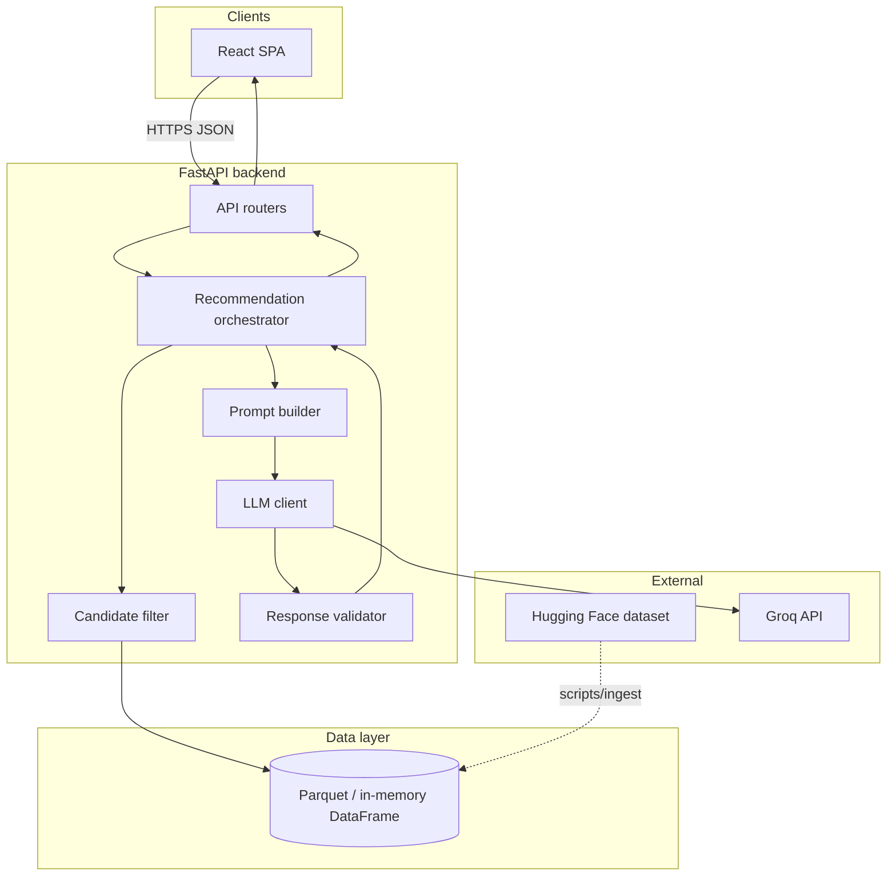
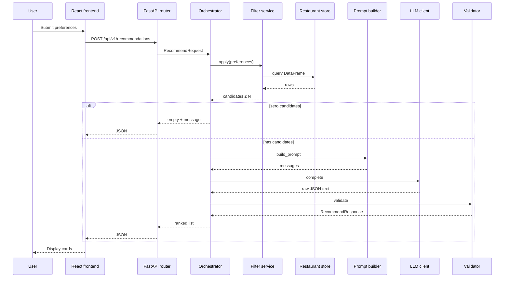
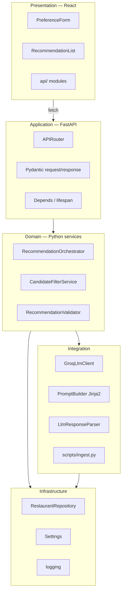
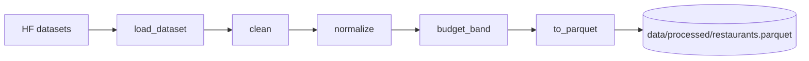
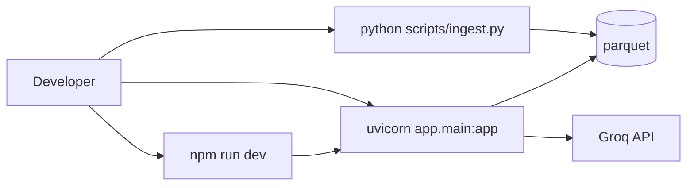

# System Architecture: AI-Powered Restaurant Recommendations

This document describes the **target architecture** for the Zomato-inspired recommendation service defined in [`problemStatement.md`](./problemStatement.md). It is the blueprint for implementation: components, data flows, interfaces, and cross-cutting concerns.

### Technology stack (recommended)

This stack is chosen for **fast Hugging Face ingest**, **minimal boilerplate**, **strong LLM ecosystem support**, and a **production-shaped UI**—without unnecessary infrastructure for an MVP.

| Tier | Choice | Role |
|------|--------|------|
| **Frontend** | **React 18** + **Vite** + **TypeScript** | Preference form, metadata dropdowns, recommendation cards |
| **Backend API** | **Python 3.11+** + **FastAPI** | REST API, validation, orchestration, OpenAPI docs |
| **Data processing** | **pandas** + **pyarrow** + Hugging Face **`datasets`** | Ingest, clean, filter (~51k rows) |
| **Data store (MVP)** | **Parquet** on disk → in-memory **pandas** `DataFrame` at startup | Fast load; optional **SQLite** extension |
| **LLM** | **[Groq](https://groq.com/)** Chat Completions API | Fast inference; OpenAI-compatible endpoint; called only from backend |
| **Config** | **pydantic-settings** + `.env` | Typed settings; no secrets in git |
| **Backend tests** | **pytest** + **httpx** (`TestClient`) | Unit + API integration with mocked LLM |
| **Frontend tests** | **Vitest** + React Testing Library (optional) | Component tests |

The React app **never** calls the LLM or reads dataset files; it only calls the FastAPI backend.

---

## 1. Architectural overview

### 1.1 Style and principles

| Principle | Implication |
|-----------|-------------|
| **Hybrid retrieval** | Deterministic filters shrink the catalog; the LLM only ranks and explains a fixed candidate set. |
| **Grounded generation** | Post-LLM validation ensures every `restaurant_id` exists in the candidate list. |
| **Separation of concerns** | Ingest, filter, prompt, LLM, validate, and UI are separate modules. |
| **Python for data + AI path** | HF load, pandas filters, and LLM client live in one backend codebase. |
| **Session-based MVP** | No auth; each recommendation request is self-contained. |
| **Cost-aware LLM usage** | Cap candidates (15–25); one LLM call per request. |

### 1.2 High-level context



### 1.3 Request lifecycle (happy path)



---

## 2. Logical layers



| Layer | Technology | Responsibility | Must not |
|-------|------------|----------------|----------|
| **Presentation** | React (Vite) | Forms, UX, cards, loading/errors | Call LLM or load Parquet |
| **Application** | FastAPI routers | HTTP, Pydantic validation, CORS, status codes | Implement filter rules inline |
| **Domain** | Plain Python services | Orchestration, filtering, validation policy | Import React or FastAPI Request in core logic |
| **Integration** | Groq SDK or OpenAI-compatible client, Jinja2, ingest | Groq Chat Completions, prompts, HF → Parquet | Own HTTP route definitions |
| **Infrastructure** | Repository, settings | Load data, env config | Business ranking rules |

---

## 3. Component specification

### 3.1 Data ingestion pipeline

**Purpose:** Download, clean, normalize, and persist restaurant records.



| Step | Behavior |
|------|----------|
| **Load** | `datasets.load_dataset("ManikaSaini/zomato-restaurant-recommendation")` |
| **Clean** | Drop rows missing name, city, rating; dedupe if key exists |
| **Normalize** | `rating` float; `approx_cost_for_two` numeric; `cuisines` string |
| **Enrich** | `budget_band`: `low` \| `medium` \| `high` from cost percentiles or ₹ bands |
| **Persist** | `restaurants.parquet` + stable `restaurant_id` |

**Trigger:** `python -m scripts.ingest` or `make ingest` — not per user request.

**Runtime:** FastAPI **lifespan** loads Parquet into `RestaurantRepository` on startup.

### 3.2 Restaurant store (repository)

| Operation | Description |
|-----------|-------------|
| `load()` | Read Parquet into pandas `DataFrame` (MVP) |
| `list_cities()` | Distinct cities for dropdowns |
| `list_cuisines(city?)` | Distinct cuisines, optional city scope |
| `query(filters)` | Boolean mask / query for hard filters |

**MVP:** In-memory `DataFrame` held by singleton repository.  
**Extension:** SQLite via SQLAlchemy or DuckDB for SQL filters and indexes.

### 3.3 Candidate filter service

**Purpose:** Hard constraints; output ≤ `MAX_CANDIDATES` (default 20).

| Filter | Rule |
|--------|------|
| Location | Case-insensitive `city` match |
| Cuisine | Substring match on `cuisines` |
| Min rating | `rating >= min_rating` |
| Budget | `budget_band == user.budget` |

**Pre-LLM:** Sort by `rating`, then `votes`; take top N.  
**Empty:** Return message; **do not** call LLM.

### 3.4 Prompt builder

- Templates: `prompts/recommend_v1.jinja2` (Jinja2)
- Variables: `preferences`, `candidates_json`, `max_recommendations`
- System + user messages; log `prompt_version` in `meta`

### 3.5 LLM client (Groq adapter)

The project uses **[Groq](https://console.groq.com/)** for hosted LLM inference (low latency, generous free tier for development). Groq exposes an **OpenAI-compatible** Chat Completions API.

```python
class LlmClient(Protocol):
    async def complete(self, messages: list[dict]) -> str: ...
```

| Concern | Approach |
|---------|----------|
| Provider | **Groq** — `https://api.groq.com/openai/v1` |
| SDK | Official **`groq`** async client (recommended), or **`openai`** SDK with `base_url` pointed at Groq |
| Default model | `llama-3.3-70b-versatile` (or `llama-3.1-8b-instant` for faster/cheaper smoke tests) |
| Retries | Tenacity: 2 retries on 429/5xx |
| Timeout | 60s |
| Structured output | `response_format={"type": "json_object"}` when the chosen Groq model supports it |
| Secrets | `GROQ_API_KEY`, `GROQ_MODEL` via `Settings` (see §6.1) |

Implementation class name: `GroqLlmClient` in `app/services/llm.py`.

Use **`async`** endpoints in FastAPI so the server stays responsive during Groq calls (typically sub-second to a few seconds).

### 3.6 Response parser and validator

- **Parser:** `json.loads`; strip markdown code fences if present
- **Validator:** Drop `restaurant_id` not in candidates; **merge facts from DataFrame**
- **Fallback:** Top 3 by rating if parse fails (optional, logged)

### 3.7 Recommendation orchestrator

```text
candidates = filter_service.apply(prefs, max=N)
if candidates.empty: return empty_response()
raw = await llm_client.complete(prompt_builder.build(...))
parsed = parser.parse(raw)
return validator.validate_and_enrich(parsed, candidates)
```

### 3.8 Presentation layer (React)

| Concern | Approach |
|---------|----------|
| Tooling | Vite + React + TypeScript |
| HTTP | `fetch` or axios → `VITE_API_BASE_URL` (default `http://localhost:8000`) |
| State | `useState` / **TanStack Query** for metadata + recommend |
| CORS | FastAPI `CORSMiddleware` → `http://localhost:5173` |
| Components | `PreferenceForm`, `RecommendationCard`, `RecommendationList`, `LoadingSpinner`, `ErrorBanner` |

---

## 4. Proposed repository layout

```text
zomato/
├── docs/
├── backend/
│   ├── pyproject.toml              # or requirements.txt
│   ├── .env.example
│   └── app/
│       ├── main.py                 # FastAPI app + lifespan
│       ├── config.py               # pydantic-settings
│       ├── api/
│       │   ├── router.py
│       │   ├── recommendations.py
│       │   └── metadata.py
│       ├── models/
│       │   ├── preferences.py
│       │   ├── restaurant.py
│       │   └── response.py
│       ├── data/
│       │   ├── ingest.py           # also callable from scripts/
│       │   └── repository.py
│       └── services/
│           ├── filter.py
│           ├── prompt.py
│           ├── llm.py
│           ├── parser.py
│           ├── validator.py
│           └── orchestrator.py
├── frontend/
│   ├── package.json
│   ├── vite.config.ts
│   ├── .env.example
│   └── src/
│       ├── App.tsx
│       ├── api/
│       ├── components/
│       └── types/
├── prompts/
│   └── recommend_v1.jinja2
├── scripts/
│   └── ingest.py
├── data/
│   └── processed/
│       └── restaurants.parquet
├── tests/
│   ├── test_filter.py
│   ├── test_validator.py
│   └── test_api.py
└── README.md
```

**Backend dependencies (MVP):** `fastapi`, `uvicorn[standard]`, `pydantic`, `pydantic-settings`, `pandas`, `pyarrow`, `datasets`, `jinja2`, `groq`, `httpx`, `tenacity`, `python-dotenv`; dev: `pytest`, `pytest-asyncio`, `ruff`. Optional: `openai` if using the OpenAI-compatible client pointed at Groq’s base URL.

**Frontend dependencies (MVP):** `react`, `react-dom`, `typescript`, `vite`; optional `@tanstack/react-query`, `axios`.

---

## 5. Data models

### 5.1 Core entities

Same logical model as problem statement: `Restaurant`, `UserPreferences`, `Recommendation`, `RecommendResponse` — implemented as **Pydantic** models in the backend and **TypeScript interfaces** in the frontend.

### 5.2 API contracts (REST)

**`POST /api/v1/recommendations`**

```json
{
  "city": "Bangalore",
  "budget": "medium",
  "cuisine": "North Indian",
  "min_rating": 4.0,
  "additional_notes": "family-friendly, not too noisy"
}
```

**Response:** `recommendations[]` with `restaurant_id`, `name`, `cuisines`, `rating`, `approx_cost_for_two`, `budget_band`, `explanation`, `rank`; plus `meta` (`candidates_considered`, `prompt_version`, `model`).

**`GET /api/v1/metadata/cities`**  
**`GET /api/v1/metadata/cuisines?city=Bangalore`**  
**`GET /api/v1/health`**

OpenAPI: **`/docs`** (Swagger UI) and **`/redoc`** generated by FastAPI.

### 5.3 LLM expected JSON shape

```json
{
  "summary": "Optional overview",
  "recommendations": [
    {
      "restaurant_id": "must match candidate",
      "rank": 1,
      "explanation": "2-3 sentences"
    }
  ]
}
```

Factual fields are **always** taken from the repository after validation.

---

## 6. Configuration

### 6.1 Backend (`.env` + `Settings`)

| Variable | Required | Default | Description |
|----------|----------|---------|-------------|
| `GROQ_API_KEY` | Yes | — | API key from [Groq Console](https://console.groq.com/keys) |
| `GROQ_MODEL` | No | `llama-3.3-70b-versatile` | Groq model id |
| `GROQ_BASE_URL` | No | `https://api.groq.com/openai/v1` | Override only for proxies or API changes |
| `DATA_PATH` | No | `data/processed/restaurants.parquet` | Processed dataset |
| `MAX_CANDIDATES` | No | `20` | Pre-LLM cap |
| `MAX_RECOMMENDATIONS` | No | `5` | Final list size |
| `CORS_ORIGINS` | No | `http://localhost:5173` | React dev server |
| `LOG_LEVEL` | No | `INFO` | Logging |

### 6.2 Frontend (`.env`)

| Variable | Required | Description |
|----------|----------|-------------|
| `VITE_API_BASE_URL` | Yes | e.g. `http://localhost:8000` |

---

## 7. Cross-cutting concerns

### 7.1 Error handling

| Scenario | HTTP |
|----------|------|
| Invalid request body | `422` (Pydantic validation) |
| No candidates | `200` + empty list + `message` |
| LLM failure | `503` |
| Unparseable LLM JSON | `502` or fallback top-3 |
| Hallucinated ids | Strip; return remainder if any valid |

### 7.2 Logging

- `request_id`, `city`, `candidate_count`, `latency_ms`
- Avoid logging full prompts in shared environments

### 7.3 Security

- API keys in `.env` only
- Cap `additional_notes` length before prompt injection
- No auth in MVP

### 7.4 Performance targets

| Stage | Target |
|-------|--------|
| Parquet load at startup | < 5s |
| Filter | < 100 ms |
| LLM | 2–15 s |
| End-to-end | < 20 s p95 |

---

## 8. Deployment views

### 8.1 Local development



```bash
# Once
python -m scripts.ingest

# Backend (port 8000)
cd backend && uvicorn app.main:app --reload

# Frontend (port 5173)
cd frontend && npm run dev
```

### 8.2 Demo deployment (optional)

| Service | Command / artifact |
|---------|-------------------|
| API | `uvicorn` in Docker; env `GROQ_API_KEY` |
| UI | `npm run build` → nginx static |
| Data | Volume mount for `restaurants.parquet` |

---

## 9. Testing strategy

| Level | Tools | Focus |
|-------|-------|--------|
| Unit | pytest | Filter, parser, validator |
| API | `httpx.AsyncClient` + `ASGITransport` | Routes; mock `LlmClient` |
| Frontend | Vitest (optional) | Cards, form |
| Manual | React + `/docs` | Golden queries; grounding vs Parquet |

---

## 10. Evolution path

| Extension | Change |
|-----------|--------|
| SQLite / DuckDB | Replace in-memory filter with indexed SQL |
| Redis cache | Cache metadata and hot filter results |
| Embeddings | `sentence-transformers` or API; merge with filter before LLM |
| Auth | FastAPI dependencies + JWT |
| Observability | OpenTelemetry + structured logging |

---

## 11. Design decisions summary

| Decision | Choice | Rationale |
|----------|--------|-----------|
| Backend | **FastAPI (Python)** | Native HF/pandas; fast iteration; auto OpenAPI |
| Frontend | **React (Vite + TS)** | Real SPA; industry-standard UI |
| Data format | **Parquet** | Compact, fast pandas load |
| LLM provider | **Groq** (`groq` SDK + JSON mode) | Fast, cost-effective inference; OpenAI-compatible API |
| Retrieval | Filter-then-LLM | Grounding + cost control |
| Runtime data | In-memory DataFrame | Simple for ~51k rows |
| Async API | async Groq client + async routes | Non-blocking during LLM calls |
| Monorepo | `backend/` + `frontend/` | Clear boundaries; shared docs |

### Alternatives considered (not MVP)

| Alternative | When to use instead |
|-------------|---------------------|
| OpenAI / Anthropic direct | Need specific models not on Groq |
| Ollama (local) | Offline dev without Groq API key |
| Spring Boot | Team mandate to learn Java enterprise patterns |
| Streamlit only | Fastest single-language demo; skip React |
| Node/NestJS | Strong TS full-stack; weaker HF ingest story |

---

## 12. Related documents

- [`problemStatement.md`](./problemStatement.md) — business problem and scope.
- [`implementationPlan.md`](./implementationPlan.md) — phase-wise build order.
- [`edgecase.md`](./edgecase.md) — edge cases and expected behavior.
- [`eval/README.md`](./eval/README.md) — per-phase evaluation criteria.
- [`../problemstatement.md`](../problemstatement.md) — original assignment brief.
