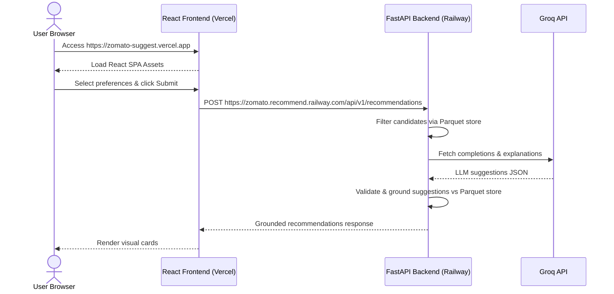

# Deployment Plan — Railway (Backend) & Vercel (Frontend)

This document outlines the step-by-step instructions, configuration, and environment setup required to deploy the **Zomato Hybrid AI Restaurant Recommender** application in a modern two-tier architecture:

- **Backend REST API:** Hosted on [Railway](https://railway.app) (Python/FastAPI)
- **Frontend Presentation Layer:** Hosted on [Vercel](https://vercel.com) (Vite/React/TypeScript)

---

## Architecture Overview



---

## 1. Backend Deployment (Railway)

Railway is excellent for running containerized or Nixpack-driven backend services. We can deploy the backend directly from our monorepo.

### Prerequisites
- A Railway account connected to GitHub.
- The `data/processed/restaurants.parquet` file committed to the repository (or set up to be built during ingest).

### Option A: Monorepo Root Deployment (Recommended)
This approach deploys the repository from the root, allowing FastAPI to easily access the parquet data file at its relative path without moving any files.

1. **Create a Railway Project:**
   - Go to the [Railway Dashboard](https://railway.app/) and click **New Project** -> **Deploy from GitHub repo**.
   - Select your repository.
   - Click **Configure variables** but do *not* deploy yet.

2. **Configure Settings & Build Commands:**
   - In the service **Settings** -> **General** tab:
     - **Root Directory:** Keep as `/` (root).
     - **Build Command:** `pip install -e "./backend[dev]"`
     - **Start Command:** `uvicorn backend.app.main:app --host 0.0.0.0 --port $PORT`
       *(Railway exposes the port dynamically via the `$PORT` environment variable)*.

3. **Configure Environment Variables:**
   Add the following variables in the **Variables** tab:
   - `LLM_API_KEY`: `gsk_...` (Your Groq API key)
   - `LLM_MODEL`: `llama-3.3-70b-versatile` (or another supported Groq model)
   - `DATA_PATH`: `data/processed/restaurants.parquet` (Path to the dataset relative to the root)
   - `CORS_ORIGINS`: `https://your-frontend-app.vercel.app` (You will update this once you generate your Vercel URL)
   - `PORT`: `8000` (Optional default, Railway overrides this)

---

### Option B: Backend Subdirectory Deployment
If you prefer to isolate Railway's build context solely to the `/backend` directory:

1. **Move/Copy Parquet File:**
   Copy the `data/processed/restaurants.parquet` file to `backend/app/data/restaurants.parquet`.

2. **Configure Service Settings on Railway:**
   - **Root Directory:** `/backend`
   - **Start Command:** `uvicorn app.main:app --host 0.0.0.0 --port $PORT`

3. **Configure Environment Variables:**
   - `DATA_PATH`: `app/data/restaurants.parquet` (relative to the `backend/` build root)
   - `LLM_API_KEY`, `LLM_MODEL`, `CORS_ORIGINS` as described in Option A.

---

## 2. Frontend Deployment (Vercel)

Vercel is optimized for building and serving static static site generators and SPA bundles (Vite + React).

### Prerequisites
- A Vercel account connected to GitHub.

### Step-by-Step Vercel Setup

1. **Create a New Project on Vercel:**
   - Go to [Vercel](https://vercel.com/) and click **Add New** -> **Project**.
   - Import your monorepo repository.

2. **Configure Project Settings:**
   - **Framework Preset:** `Vite` (Vercel should auto-detect this).
   - **Root Directory:** `frontend`
   - **Build Command:** `npm run build`
   - **Output Directory:** `dist`

3. **Configure Environment Variables:**
   Expand the **Environment Variables** section and add:
   - `VITE_API_BASE_URL`: `https://zomato.recommend.railway.com`
     *(This is the public domain generated by Railway for your backend service)*.

4. **SPA Route Rewrite (Optional but Recommended):**
   To support client-side routing and prevent `404` errors if users reload pages, create a `frontend/vercel.json` file in the codebase:
   ```json
   {
     "rewrites": [
       { "source": "/(.*)", "destination": "/index.html" }
     ]
   }
   ```

5. **Deploy:** Click **Deploy**. Vercel will install dependencies, compile the TypeScript source, build production assets, and provision a SSL-secured CDN domain.

---

## 3. Post-Deployment Checklist & Verification

### Step 1: Link CORS Origins
Once the frontend is successfully deployed to Vercel (e.g., `https://zomato-rec.vercel.app`):
1. Go to your Railway service's **Variables** tab.
2. Update the `CORS_ORIGINS` value to your exact Vercel deployment URL:
   ```text
   CORS_ORIGINS=https://zomato-rec.vercel.app
   ```
3. Railway will automatically redeploy the service to apply the new CORS policy.

### Step 2: Health Verification
1. Access the backend health endpoint in your browser:
   `https://zomato.recommend.railway.com/api/v1/health`
2. Confirm the JSON returns:
   ```json
   {
     "status": "ok",
     "data_loaded": true,
     "restaurant_count": 41665,
     "message": "API and restaurant data are ready."
   }
   ```

### Step 3: End-to-End Test
1. Open the Vercel URL `https://your-frontend-app.vercel.app`.
2. Check that the health badge displays **System Connected** (indicating the frontend successfully polled the `/health` API).
3. Submit a preference request (e.g., *Bangalore, North Indian, medium budget, Rating 4.0+*) and verify that the UI renders grounded AI suggestion cards correctly.
