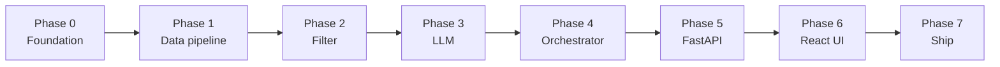

# Phase-Wise Implementation Plan

This plan turns [`problemStatement.md`](./problemStatement.md) and [`architecture.md`](./architecture.md) into a **sequential build path** using the **recommended stack**:

- **Backend:** Python 3.11+ · **FastAPI** · pandas · **[Groq](https://groq.com/)** LLM  
- **Frontend:** **React** · Vite · TypeScript  

Each phase has deliverables, tasks, and exit criteria.

**Evaluation:** After each phase, complete the checklist in [`eval/phase-N/eval.md`](./eval/phase-N/eval.md) (see [`eval/README.md`](./eval/README.md)).

**Edge cases:** [`edgecase.md`](./edgecase.md) — scenarios to handle and test per layer.

---

## Technology summary

| Tier | Stack |
|------|--------|
| **Backend** | FastAPI, Pydantic, pydantic-settings, uvicorn |
| **Data** | Hugging Face `datasets`, pandas, Parquet (`pyarrow`) |
| **LLM** | **[Groq](https://groq.com/)** — `groq` Python SDK (async); Chat Completions at `https://api.groq.com/openai/v1` |
| **Frontend** | React 18, TypeScript, Vite |
| **Tests** | pytest, httpx `TestClient`; optional Vitest |
| **Prompts** | Jinja2 templates in `prompts/` |

---

## Overview

| Phase | Name | Stack | Maps to objective | Est. effort |
|-------|------|-------|-------------------|-------------|
| 0 | Foundation | Python venv + npm | — | 0.5–1 day |
| 1 | Data ingest & repository | pandas, Parquet | **1. Ingest** | 1–2 days |
| 2 | Filter service | Python services | **3. Filter** | 1 day |
| 3 | LLM integration | Groq, Jinja2 | **4. LLM** | 2–3 days |
| 4 | Orchestrator | Python | **3–4. Integration** | 1 day |
| 5 | REST API | FastAPI | **2. Collect** (API) | 1 day |
| 6 | React UI | Vite + TS | **2, 5. Display** | 2–3 days |
| 7 | Hardening & eval | pytest + manual | All | 1–2 days |

**Total (MVP):** roughly **8–13 days** for one full-stack developer.

---

## Phase 0: Project foundation

**Goal:** Runnable `backend/` and `frontend/` with config, CORS, and health check.

### Tasks

| # | Task | Output |
|---|------|--------|
| 0.1 | Create `backend/pyproject.toml` (or `requirements.txt`) | fastapi, uvicorn, pydantic-settings, pandas, pyarrow, datasets, jinja2, **groq**, httpx, tenacity, pytest |
| 0.2 | `backend/app/main.py` — FastAPI app, lifespan stub, CORS for `:5173` | Port **8000** |
| 0.3 | `backend/app/config.py` — `Settings` via pydantic-settings | Loads `.env` |
| 0.4 | `GET /api/v1/health` | Health router |
| 0.5 | `frontend/` — `npm create vite@latest` (react-ts) | Port **5173** |
| 0.6 | `backend/.env.example`, `frontend/.env.example` | `GROQ_API_KEY`, `GROQ_MODEL`, `VITE_API_BASE_URL` |
| 0.7 | Root `README.md` + `.gitignore` | Python venv, node_modules, `.env`, `data/raw/` |
| 0.8 | Folder layout per [architecture §4](./architecture.md#4-proposed-repository-layout) | `app/`, `prompts/`, `scripts/`, `tests/` |

### Exit criteria

- [ ] `uvicorn app.main:app --reload` starts on :8000.
- [ ] `npm run dev` starts React on :5173.
- [ ] `GET /api/v1/health` returns OK.
- [ ] `pytest` runs (empty or placeholder test).

**Eval doc:** [phase-0/eval.md](./eval/phase-0/eval.md)

### Dependencies

None.

---

## Phase 1: Data ingestion & restaurant store

**Goal:** Objective **1 (Ingest)** — HF → Parquet; repository loaded at FastAPI startup.

**Architecture refs:** [§3.1](./architecture.md#31-data-ingestion-pipeline), [§3.2](./architecture.md#32-restaurant-store-repository).

### Tasks

| # | Task | Output |
|---|------|--------|
| 1.1 | Document schema in `docs/dataSchema.md` | Column mapping |
| 1.2 | `scripts/ingest.py` + `app/data/ingest.py` — load HF dataset | Reusable ingest |
| 1.3 | Clean, normalize, `budget_band`, `restaurant_id` | pandas pipeline |
| 1.4 | Write `data/processed/restaurants.parquet` | ~50k rows |
| 1.5 | Pydantic `Restaurant` model | `app/models/restaurant.py` |
| 1.6 | `RestaurantRepository` — load Parquet, `list_cities`, `list_cuisines`, base `DataFrame` | `app/data/repository.py` |
| 1.7 | FastAPI lifespan: `repository.load()` on startup; log count + duration | Fail if file missing |
| 1.8 | `make ingest` or `python -m scripts.ingest` in README | One-command ingest |

### Exit criteria

- [ ] Ingest completes; Parquet row count reasonable after cleaning.
- [ ] API startup logs `Loaded N restaurants`.
- [ ] `list_cities()` includes Bangalore, Delhi.
- [ ] Bangalore subset non-empty in repository.

**Eval doc:** [phase-1/eval.md](./eval/phase-1/eval.md)

### Dependencies

Phase 0.

---

## Phase 2: Domain models & candidate filtering

**Goal:** Deterministic shortlist — **no LLM**.

**Architecture refs:** [§3.3](./architecture.md#33-candidate-filter-service).

### Tasks

| # | Task | Output |
|---|------|--------|
| 2.1 | `UserPreferences` + `BudgetBand` enum in Pydantic | `app/models/preferences.py` |
| 2.2 | `CandidateFilterService.apply(prefs, max_candidates)` | pandas masks + sort |
| 2.3 | Filters: city, cuisine, min_rating, budget_band | All hard constraints |
| 2.4 | Return `list[Restaurant]` capped at `MAX_CANDIDATES` | Ready for prompt |
| 2.5 | `tests/test_filter.py` with small Parquet/CSV fixture | pytest |
| 2.6 | Optional dev script: print top candidates for sample prefs | Quick smoke |

### Exit criteria

- [ ] “Bangalore, medium, North Indian, 4.0+” returns ≤ 20 rows.
- [ ] Invalid city → empty list.
- [ ] `pytest tests/test_filter.py` passes.

**Eval doc:** [phase-2/eval.md](./eval/phase-2/eval.md)

### Dependencies

Phase 1.

---

## Phase 3: LLM integration (Groq)

**Goal:** Objective **4** — prompts, async **Groq** client, parse, validate.

**Architecture refs:** [§3.4–3.6](./architecture.md#34-prompt-builder), [§3.5 Groq adapter](./architecture.md#35-llm-client-groq-adapter).

**Provider:** [Groq](https://console.groq.com/) — obtain `GROQ_API_KEY` from the console. Default model: `llama-3.3-70b-versatile`.

### Tasks

| # | Task | Output |
|---|------|--------|
| 3.1 | `prompts/recommend_v1.jinja2` | Grounding + JSON instructions |
| 3.2 | `PromptBuilder` (Jinja2) | `app/services/prompt.py` |
| 3.3 | `LlmClient` protocol + `GroqLlmClient` (async, `groq` SDK) | `app/services/llm.py` |
| 3.4 | Wire `Settings`: `GROQ_API_KEY`, `GROQ_MODEL`, `GROQ_BASE_URL`, timeout, retries (tenacity) | `app/config.py` |
| 3.5 | `LlmResponseParser` — JSON parse, fence stripping | `app/services/parser.py` |
| 3.6 | `RecommendationValidator` — id check, enrich from DataFrame | `app/services/validator.py` |
| 3.7 | `Recommendation`, `RecommendResponse` Pydantic models | `app/models/response.py` |
| 3.8 | `tests/test_parser.py`, `tests/test_validator.py` | No live Groq API in CI |
| 3.9 | Async smoke script with mock or real `GROQ_API_KEY` | `scripts/llm_smoke.py` |

### Exit criteria

- [ ] Mocked test returns ranked items with explanations.
- [ ] All `restaurant_id` values ⊆ candidates.
- [ ] `rating` / `approx_cost_for_two` from repository, not LLM.

**Eval doc:** [phase-3/eval.md](./eval/phase-3/eval.md)

### Dependencies

Phase 2.

---

## Phase 4: Recommendation orchestrator

**Goal:** Single `get_recommendations` flow: filter → prompt → LLM → validate.

**Architecture refs:** [§3.7](./architecture.md#37-recommendation-orchestrator).

### Tasks

| # | Task | Output |
|---|------|--------|
| 4.1 | `RecommendationOrchestrator` (async) | `app/services/orchestrator.py` |
| 4.2 | Zero candidates → no LLM; return `message` | Cost control |
| 4.3 | Parse failure → log + optional top-3 fallback | Resilience |
| 4.4 | Fill `meta`: candidates_considered, prompt_version, model | Response transparency |
| 4.5 | `tests/test_orchestrator.py` with mocked `LlmClient` | pytest-asyncio |
| 4.6 | Structured logging with timing | `logging` module |

### Exit criteria

- [ ] Orchestrator test passes with mock LLM.
- [ ] Empty filter never calls LLM.
- [ ] ≤ `MAX_RECOMMENDATIONS` items on success.

**Eval doc:** [phase-4/eval.md](./eval/phase-4/eval.md)

### Dependencies

Phase 3.

---

## Phase 5: REST API (FastAPI)

**Goal:** Stable JSON contract for React; auto OpenAPI at `/docs`.

**Architecture refs:** [§5.2](./architecture.md#52-api-contracts-rest).

### Tasks

| # | Task | Output |
|---|------|--------|
| 5.1 | `RecommendRequest` / `RecommendResponse` schemas | Pydantic models |
| 5.2 | `POST /api/v1/recommendations` → orchestrator | `app/api/recommendations.py` |
| 5.3 | `GET /api/v1/metadata/cities` | `app/api/metadata.py` |
| 5.4 | `GET /api/v1/metadata/cuisines?city=` | Scoped list |
| 5.5 | Inject repository + orchestrator via `Depends` | Testable DI |
| 5.6 | Exception handlers → 422, 503, consistent JSON errors | `main.py` or `exceptions.py` |
| 5.7 | `tests/test_api.py` with `TestClient` + mock LLM | Integration |
| 5.8 | Verify `/docs` and sample `curl` | Contract sign-off |

### Exit criteria

- [ ] POST returns JSON per architecture §5.2.
- [ ] Invalid `budget` → 422 with details.
- [ ] CORS works from React dev server.

**Eval doc:** [phase-5/eval.md](./eval/phase-5/eval.md)

### Dependencies

Phase 4.

**Note:** Start Phase 6 layout once request/response JSON is frozen (OpenAPI export or hand-written `types/api.ts`).

---

## Phase 6: React presentation layer

**Goal:** Objectives **2** and **5** — form + recommendation cards.

**Architecture refs:** [§3.8](./architecture.md#38-presentation-layer-react).

### Tasks

| # | Task | Output |
|---|------|--------|
| 6.1 | `src/api/client.ts` — `VITE_API_BASE_URL` | Base fetch wrapper |
| 6.2 | `metadata.ts`, `recommendations.ts` | Typed API calls |
| 6.3 | `types/api.ts` — mirror Pydantic models | TS interfaces |
| 6.4 | `PreferenceForm.tsx` | city, budget, cuisine, min_rating, notes |
| 6.5 | `RecommendationCard.tsx`, `RecommendationList.tsx` | 5 required fields |
| 6.6 | `App.tsx` — submit, loading, errors, empty state | LLM latency UX |
| 6.7 | Optional: TanStack Query for metadata + mutation | Cleaner async |
| 6.8 | Basic responsive styling | Demo-ready |

### Exit criteria

- [ ] Golden query works in browser: *Bangalore, medium, North Indian, ≥ 4*.
- [ ] Cards show name, cuisine, rating, cost, explanation.
- [ ] API errors displayed gracefully.

**Eval doc:** [phase-6/eval.md](./eval/phase-6/eval.md)

### Dependencies

Phase 5 (or OpenAPI mock).

---

## Phase 7: Testing, documentation & evaluation

**Goal:** Submission-ready MVP with grounding verification.

### Tasks

| # | Task | Output |
|---|------|--------|
| 7.1 | Expand pytest: filter edges, notes length cap | Coverage |
| 7.2 | Optional Vitest for `RecommendationCard` | Frontend unit |
| 7.3 | `docs/evalQueries.md` — 5–10 manual cases | Sign-off |
| 7.4 | Manual eval vs Parquet | Grounding checklist |
| 7.5 | README: venv, ingest, uvicorn, npm, env vars | Full onboarding |
| 7.6 | Optional: `docker-compose.yml` (api + nginx frontend) | Stretch |
| 7.7 | Optional: `ruff` + pre-commit | Code quality |

### Exit criteria (MVP complete)

- [ ] `pytest` passes.
- [ ] ≥ 5 manual eval queries done.
- [ ] No secrets in git.
- [ ] New dev: ingest → API → UI in < 15 minutes.

**Eval doc:** [phase-7/eval.md](./eval/phase-7/eval.md)

### Dependencies

Phases 0–6.

---

## Phase summary checklist

| Phase | Done | Eval |
|-------|------|------|
| 0 Foundation | ☑ | [eval](./eval/phase-0/eval.md) |
| 1 Data | ☑ | [eval](./eval/phase-1/eval.md) |
| 2 Filter | ☑ | [eval](./eval/phase-2/eval.md) |
| 3 LLM | ☐ | [eval](./eval/phase-3/eval.md) |
| 4 Orchestrator | ☐ | [eval](./eval/phase-4/eval.md) |
| 5 API | ☐ | [eval](./eval/phase-5/eval.md) |
| 6 React | ☐ | [eval](./eval/phase-6/eval.md) |
| 7 Ship | ☐ | [eval](./eval/phase-7/eval.md) |

---

## Parallel work opportunities

| Can parallelize | With |
|-----------------|------|
| React scaffold + form layout (6.4) | Phases 2–3 backend |
| `docs/dataSchema.md` | Ingest (1.2) |
| `types/api.ts` from `/openapi.json` | Phase 5 schemas |
| Jinja2 prompt (3.1) | Phase 2 filter |

**Do not parallelize:** React live API calls (6.6) before Phase 5 contract; orchestrator (4) before parser (3).

---

## Milestones vs problem statement

| Objective | Phase |
|-----------|-------|
| 1. Ingest | **1** |
| 2. Collect preferences | **5** + **6** |
| 3. Filter | **2** (+ **4** empty path) |
| 4. LLM | **3** + **4** |
| 5. Present results | **5** + **6** |

---

## Optional post-MVP phases

| Phase | Focus |
|-------|--------|
| 8 | SQLite/DuckDB instead of in-memory DataFrame |
| 9 | Redis cache for metadata / hot filters |
| 10 | Embedding search (`sentence-transformers`) before LLM |
| 11 | JWT auth + history |
| 12 | CI: pytest + `npm test` + Docker |

---

## Related documents

- [`problemStatement.md`](./problemStatement.md)  
- [`architecture.md`](./architecture.md) — FastAPI + React design  
- [`edgecase.md`](./edgecase.md) — edge case catalog  
- [`eval/README.md`](./eval/README.md) — per-phase evaluation index  
- [`../problemstatement.md`](../problemstatement.md)  
