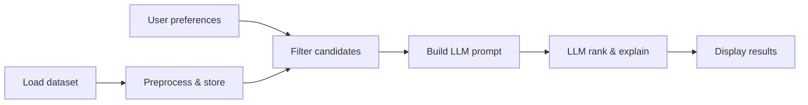

# Problem Statement: AI-Powered Restaurant Recommendations (Zomato Use Case)

## Project context

This repository is an **Airtribe learning project** that implements a small, end-to-end **restaurant recommendation service** inspired by [Zomato](https://www.zomato.com/). The goal is not to replicate Zomato’s production stack, but to practice how modern apps combine **structured data**, **deterministic filtering**, and **large language models (LLMs)** to deliver useful, explainable suggestions.

Restaurant discovery is a familiar problem: users have constraints (where they are, what they can spend, what they want to eat) and a large catalog of options. Pure keyword search or rigid filters often return too many or too few results and do not explain *why* a place is a good fit. This project explores a **hybrid pipeline**: narrow the catalog with data-driven filters, then use an LLM to rank, compare, and explain the best matches in natural language.

---

## Problem we are solving

**Users need personalized restaurant recommendations that respect hard constraints and still feel human and trustworthy.**

| Challenge | How this project addresses it |
|-----------|-------------------------------|
| Large catalogs (tens of thousands of venues) | Load and query a real Zomato-style dataset; filter before calling the LLM |
| Subjective preferences (“family-friendly”, “quick bite”) | Capture free-text or structured preferences and pass them into the prompt |
| Opaque rankings | Ask the LLM to justify each suggestion against the user’s stated criteria |
| Cold start / no user history | Rely on explicit preferences per session rather than collaborative filtering |

The core design choice is **not** to let the LLM invent restaurants. The LLM works only on **candidate rows** produced by filtering real data, which keeps recommendations grounded and reduces hallucination risk.

---

## Objectives

Build an application that:

1. **Ingests** restaurant data from a public dataset and exposes the fields needed for search and display.
2. **Collects** user preferences (location, budget, cuisine, minimum rating, and optional notes).
3. **Filters** the dataset to a manageable shortlist that satisfies hard constraints.
4. **Invokes** an LLM with a structured prompt so it can rank options and write short explanations.
5. **Presents** top recommendations in a clear UI or API response.

Success looks like: given realistic inputs (e.g. “Bangalore, medium budget, North Indian, rating ≥ 4”), the system returns a small set of **real** restaurants with **consistent** metadata and **readable** rationale for each pick.

---

## Data source

- **Dataset:** [ManikaSaini/zomato-restaurant-recommendation](https://huggingface.co/datasets/ManikaSaini/zomato-restaurant-recommendation) on Hugging Face (~51k rows).
- **Expected fields** (names may vary in the raw schema; map during preprocessing):
  - Restaurant name
  - Location / city / area
  - Cuisine(s)
  - Approximate cost for two (or similar budget signal)
  - Aggregate rating
  - Any other columns useful for filtering or display (votes, address, etc.)

Preprocessing should normalize types (ratings as numbers, cost bands if needed), handle missing values, and keep only columns required for filtering, prompting, and output.

---

## System workflow

### 1. Data ingestion

- Download or stream the Hugging Face dataset.
- Clean and index fields used for filtering and display.
- Optionally persist processed data locally (CSV, Parquet, or in-memory) for faster repeat runs.

### 2. User input

Collect preferences such as:

| Input | Examples |
|-------|----------|
| Location | Delhi, Bangalore, specific locality |
| Budget | low / medium / high (mapped from cost-for-two or similar) |
| Cuisine | Italian, Chinese, North Indian, … |
| Minimum rating | e.g. 4.0+ |
| Additional context | family-friendly, quick service, outdoor seating, … |

### 3. Integration layer

- Apply **deterministic filters** on location, budget, cuisine, and rating.
- Cap the number of rows sent to the LLM (e.g. top N by rating or relevance) to control cost and context size.
- Format candidates as structured text or JSON inside the prompt.
- Use a prompt template that instructs the model to: rank only from the provided list, cite user criteria, and avoid fabricating venues.

### 4. Recommendation engine (LLM)

The LLM should:

- Rank the provided candidates.
- Explain why each recommendation matches the user’s preferences.
- Optionally summarize trade-offs (e.g. higher rating vs. lower cost).

### 5. Output display

Present a small set of top picks, each including at minimum:

- Restaurant name  
- Cuisine  
- Rating  
- Estimated cost (or budget band)  
- AI-generated explanation  

---

## Scope and non-goals

**In scope for this project**

- Session-based recommendations from explicit user input.
- Hybrid filter-then-LLM architecture.
- A simple interface (**React** web UI + **FastAPI** REST API) to demonstrate the flow.

**Out of scope (unless explicitly extended later)**

- User accounts, order placement, or payments.
- Real-time Zomato API integration.
- Production-grade observability, A/B testing, or geo-routing.
- Training a custom recommendation model; ranking for the MVP is LLM-assisted on filtered data.

---

## Technical considerations

- **Grounding:** Never recommend restaurants not present in the filtered candidate set passed to the LLM.
- **Latency & cost:** Filter aggressively; limit prompt size and number of LLM calls per request.
- **Secrets:** API keys for the LLM provider belong in environment variables, not in the repository.
- **Evaluation:** Manually verify a sample of queries—check that names, cities, and ratings match the dataset and that explanations reference the user’s inputs.

---

## Reference

- **Architecture:** [`architecture.md`](./architecture.md) — components, data flows, API contracts, and proposed repo layout.
- **Implementation plan:** [`implementationPlan.md`](./implementationPlan.md) — phase-wise build order, tasks, and exit criteria.
- **Edge cases:** [`edgecase.md`](./edgecase.md) — non-happy-path scenarios and expected behavior.
- **Phase evaluation:** [`eval/README.md`](./eval/README.md) — pass/fail checklists per implementation phase.
- **Assignment brief:** [`problemstatement.md`](../problemstatement.md) at the repo root.

This document expands the brief with project context, problem framing, and implementation expectations for anyone onboarding to the codebase.
